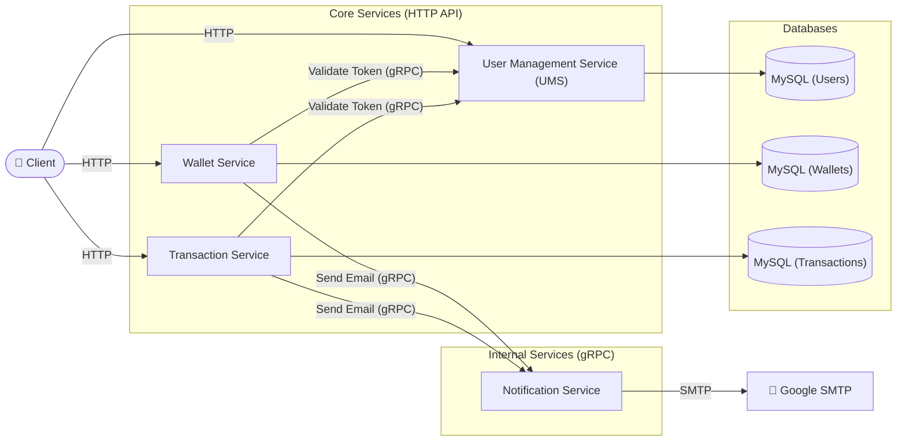

# E-Wallet Framework (Golang)


A production-ready Backend Framework for an E-Wallet application built in Go. This repository serves as a live progress tracker for building a robust, scalable, and enterprise-grade backend system.

## 🏗️ System Architecture

Arsitektur aplikasi E-Wallet ini memisahkan layanan menjadi beberapa *microservices* internal. Komunikasi ke *Client* menggunakan HTTP REST, sedangkan komunikasi antar layanan dan validasi token menggunakan gRPC.



## 🛠️ Tech Stack

- **Language:** Go 1.25+
- **HTTP Router:** [Gin](https://github.com/gin-gonic/gin)
- **RPC:** gRPC
- **Database ORM:** [GORM](https://gorm.io/)
- **Database Engine:** MySQL
- **Configuration:** [Koanf](https://github.com/knadh/koanf)
- **Logging:** [Zap](https://github.com/uber-go/zap)

---

## 📈 Progress Tracker

### ✅ Yang Sudah Dibuat (Done)

**Core Architecture & Bootstrapping**
- [x] Hierarchical Config Management (`.env` & OS Env)
- [x] Structured Logging Setup (Zap)
- [x] Database Connection Pooling & Ping Verification
- [x] HTTP Server (Gin) & gRPC Server Implementation
- [x] Graceful Shutdown (Signal, Context Cancellation, WaitGroup)
- [x] Health Check Endpoint (HTTP GET /health) with DB Ping

**User Management Service (UMS)**
- [x] DB Migration, Register & Password Hashing (Bcrypt)
- [x] Login JWT & Session DB Storage
- [x] Logout Mechanism & Auth Middleware
- [x] Refresh Token Sync & Session Sync
- [x] Internal Token Validation Server (gRPC)

---

### 🎯 Target Selanjutnya (Up Next)

**Wallet Service**
- [ ] Setup Repository & DB Connection
- [ ] API Create Wallet (Dipanggil UMS Pasca-Register)
- [ ] API Credit Balance
- [ ] API Debit Balance
- [ ] API Get Balance
- [ ] API Wallet History (Log Transaksi)

---

## 🚀 Cara Menjalankan Aplikasi Lokal

1. Pastikan mesin MySQL sudah menyala di lokal.
2. Buat database bernama `ewallet` (`mysql -u root -e "CREATE DATABASE ewallet;"`).
3. Buat file `.env` dari `.env.example` dan isi `DB_URI` dengan kredensial aslimu.
4. Jalankan aplikasi:
   ```bash
   go run cmd/api/*.go
   ```
